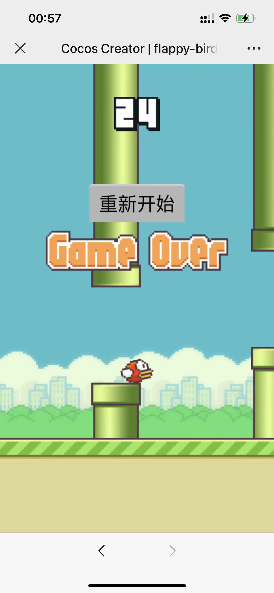

# flappy bird

基于 https://github.com/dsiver144/cocos2d-flappybird 在cocos creator v3.8上复现的flappy bird游戏，感谢原作者！

  

同时提供后端部署方案，基于python的FastAPI框架进行快速部署，仅需要5行代码：

`build/web-mobile/b2.py`

首先安装FastAPI，然后进入`build/web-mobile`目录下执行以下命令启动服务：

`uvicorn b2:app --reload --host 0.0.0.0 --port 8888`

随后进入
`http://[你的IP]:8888/static/index.html` 进行游戏。
